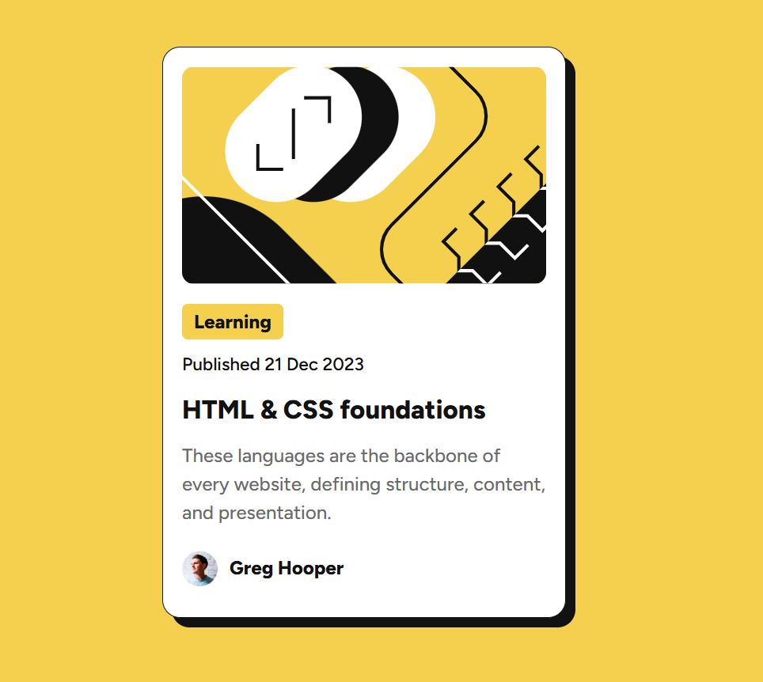

# Frontend Mentor - Blog preview card solution

This is a solution to the [Blog preview card challenge on Frontend Mentor](https://www.frontendmentor.io/challenges/blog-preview-card-ckPaj01IcS).

## Table of contents

- [Overview](#overview)
  - [The challenge](#the-challenge)
  - [Screenshot](#screenshot)
  - [Links](#links)
- [My process](#my-process)
  - [Built with](#built-with)
  - [What I learned](#what-i-learned)
  - [Useful resources](#useful-resources)
- [Author](#author)

## Overview

Blog preview card challenge is a simple challenge that requires you to build out a blog preview card and get it looking as close to the design as possible.

### The challenge

Users should be able to:

- See hover and focus states for all interactive elements on the page

### Screenshot

### Links

- Solution URL: [Add solution URL here](https://your-solution-url.com)
- Live Site URL: [Add live site URL here](https://your-live-site-url.com)

## My process

### Built with

- Semantic HTML5 markup
- CSS custom properties
- Flexbox
- CSS Grid

### What I learned

- I learned about how to set up a local font and the usage of css font-faces.

- the basics of box shadow

### Useful resources

- [box-shadow](https://developer.mozilla.org/en-US/docs/Web/CSS/box-shadow) - This helped me with box-shadow.
- [font-face](https://www.digitalocean.com/community/tutorials/how-to-load-and-use-custom-fonts-with-css) - This is an amazing article which helped me finally understand font-faces. I'd recommend it to anyone still learning this concept.

## Author

- Frontend Mentor - [@kirlosbasta](https://www.frontendmentor.io/profile/kirlosbasta)
- LinkedIn - [kirlos-basta](https://www.linkedin.com/in/kirlos-basta/)
